# Workflow — Các Luồng Hoạt Động

Tài liệu mô tả chi tiết các workflow trong hệ thống nhận diện vân tay phân tán.

---

## Mục Lục

1. [Kết nối Worker → Orchestrator (Khởi động)](#1-kết-nối-worker--orchestrator-khởi-động)
2. [Heartbeat & Giám sát trạng thái](#2-heartbeat--giám-sát-trạng-thái)
3. [Đẩy & Cập nhật Model AI](#3-đẩy--cập-nhật-model-ai)
4. [Đăng ký vân tay (Enrollment)](#4-đăng-ký-vân-tay-enrollment)
5. [Broadcast dữ liệu đăng ký](#5-broadcast-dữ-liệu-đăng-ký-tới-các-worker-khác)
6. [Xác thực vân tay (Verify / Identify)](#6-xác-thực-vân-tay-verify--identify)
7. [Streaming realtime (WebSocket)](#7-streaming-realtime-websocket)
8. [Hoạt động khi mất mạng (Offline Mode)](#8-hoạt-động-khi-mất-mạng-offline-mode)
9. [Đồng bộ khi có lại mạng (Reconnect Sync)](#9-đồng-bộ-khi-có-lại-mạng-reconnect-sync)
10. [Xoá User / Fingerprint (Broadcast Delete)](#10-xoá-user--fingerprint-broadcast-delete)
11. [Upload ảnh qua MinIO (Presigned URL)](#11-upload-ảnh-qua-minio-presigned-url)

---

## 1. Kết nối Worker → Orchestrator (Khởi động)

Khi worker khởi động, nó tự động kết nối MQTT broker và thông báo cho orchestrator.

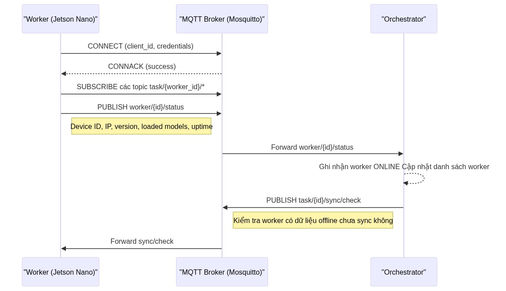

---

## 2. Heartbeat & Giám sát Trạng Thái

Worker gửi heartbeat định kỳ. Orchestrator đánh dấu offline khi quá timeout.

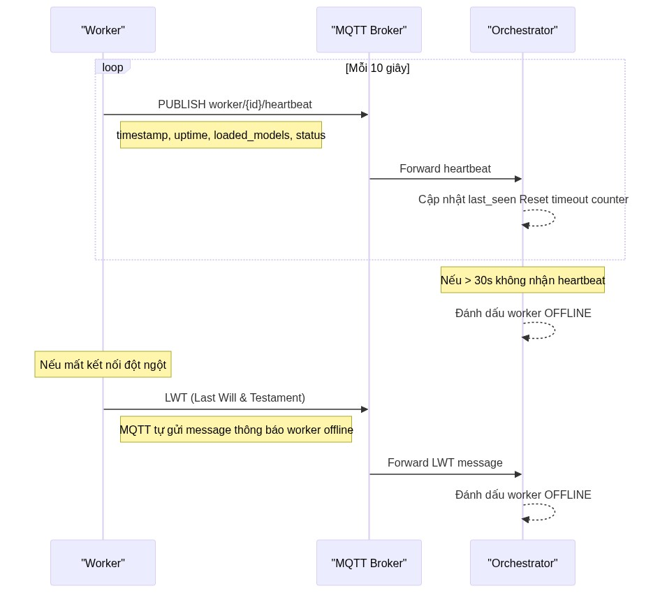

---

## 3. Đẩy & Cập nhật Model AI

Orchestrator đẩy lệnh cập nhật model xuống worker. Worker tải model từ MinIO, convert sang TensorRT.

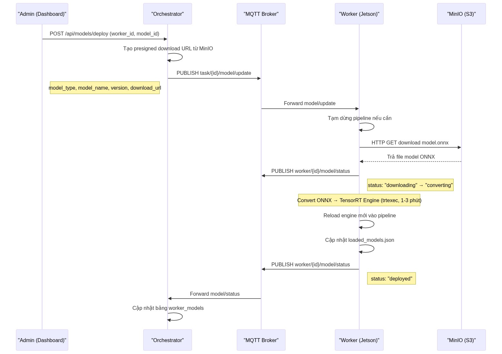

---

## 4. Đăng ký Vân Tay (Enrollment)

Quy trình đăng ký người dùng mới tại thiết bị biên.

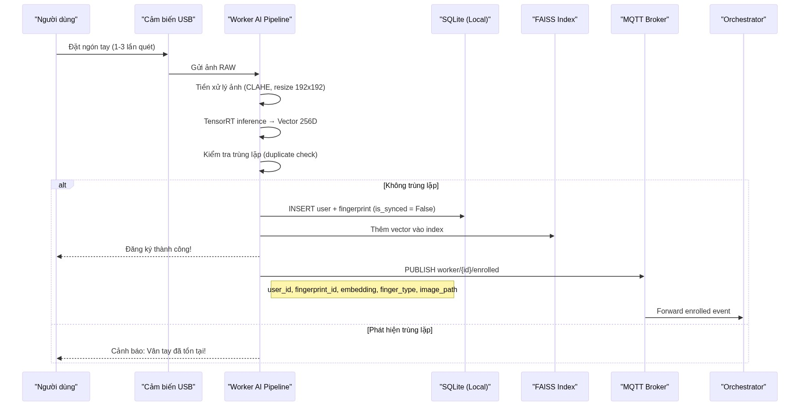

---

## 5. Broadcast Dữ Liệu Đăng Ký Tới Các Worker Khác

Khi một worker đăng ký user mới, orchestrator đồng bộ dữ liệu tới tất cả worker khác.

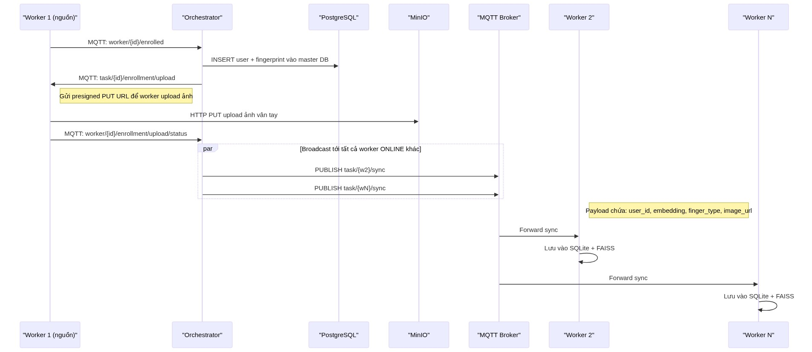

---

## 6. Xác thực Vân Tay (Verify / Identify)

Khi người dùng đập ngón tay vào để cửa mở / chấm công. Tốc độ trên Edge dưới 0.2s.

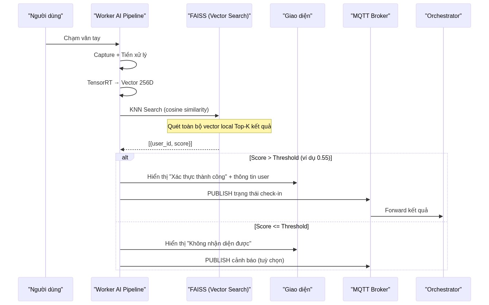

---

## 7. Streaming Realtime (WebSocket)

Preview ảnh vân tay real-time từ sensor qua WebSocket.

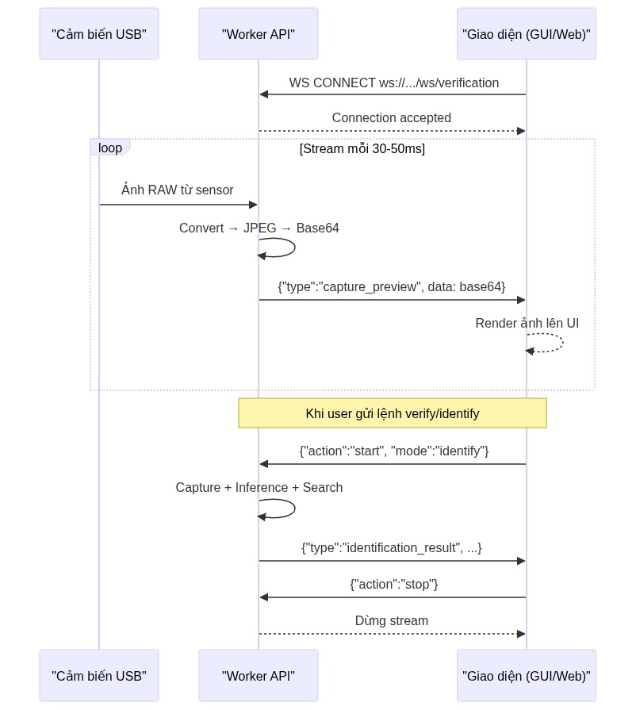

---

## 8. Hoạt Động Khi Mất Mạng (Offline Mode)

Điểm mạnh Edge AI: Nếu Jetson Nano đứt mạng, người dùng vẫn đăng ký bình thường. Máy sẽ tạo cờ chờ (Queue).

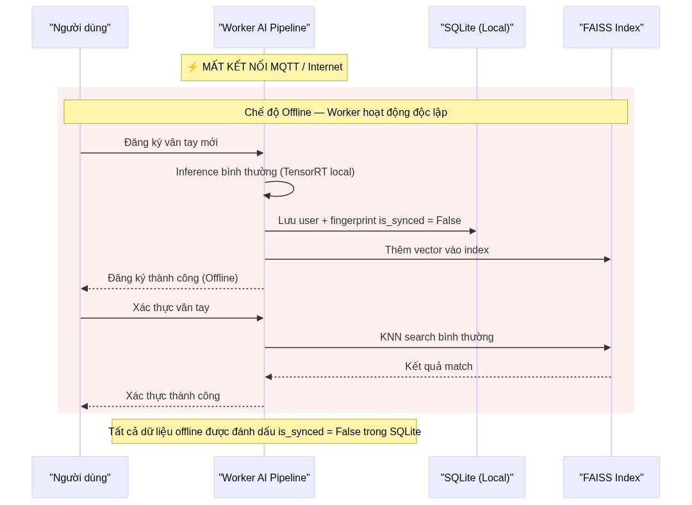

---

## 9. Đồng Bộ Khi Có Lại Mạng (Reconnect Sync)

Khi worker kết nối lại, orchestrator yêu cầu flush dữ liệu offline.

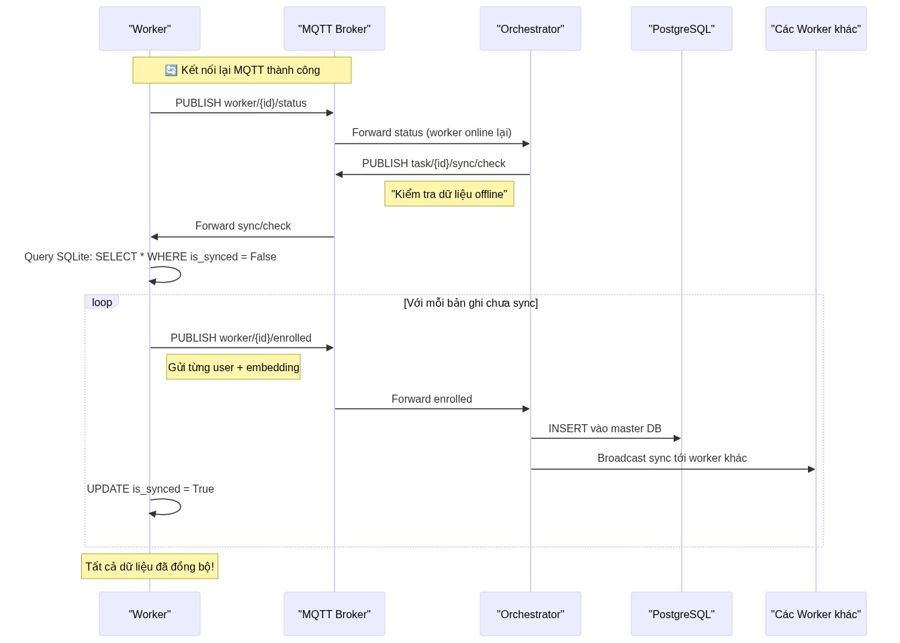

---

## 10. Xoá User / Fingerprint (Broadcast Delete)

Khi admin xoá user/fingerprint từ dashboard, orchestrator broadcast tới tất cả worker.

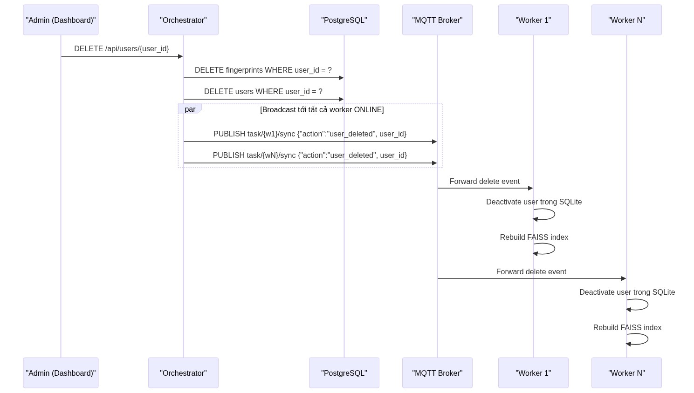

---

## 11. Upload Ảnh qua MinIO (Presigned URL)

Worker upload ảnh vân tay lên MinIO thông qua presigned PUT URL.

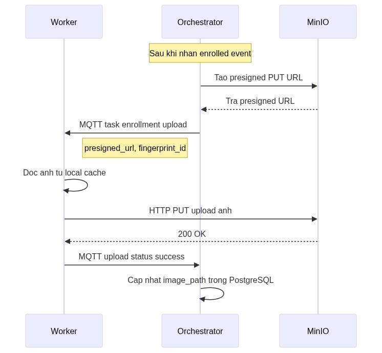

---

## Tổng Quan Luồng Dữ Liệu

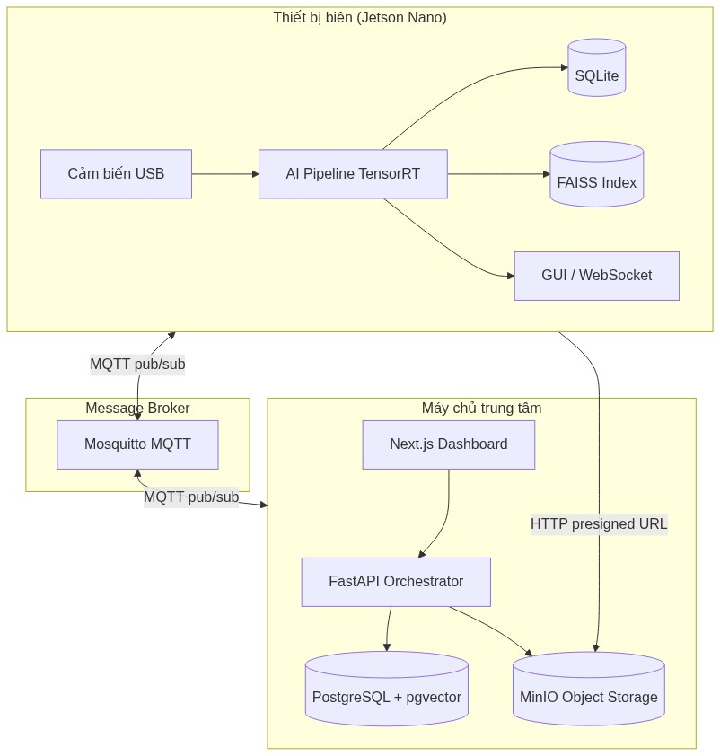
